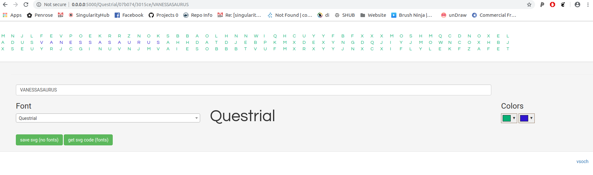

# banner-maker

A flask application to dynamically generate a vector (svg) graphic for a banner with text, font, and colors of choice.
The preview is no longer running, but you can test the Docker container:

```bash
$ docker run -p 5000:5000 vanessa/banner-maker
 * Serving Flask app "index" (lazy loading)
 * Environment: production
   WARNING: Do not use the development server in a production environment.
   Use a production WSGI server instead.
 * Debug mode: on
 * Running on http://0.0.0.0:5000/ (Press CTRL+C to quit)
 * Restarting with stat
 * Debugger is active!
 * Debugger PIN: 242-995-159
```

And see the result:



